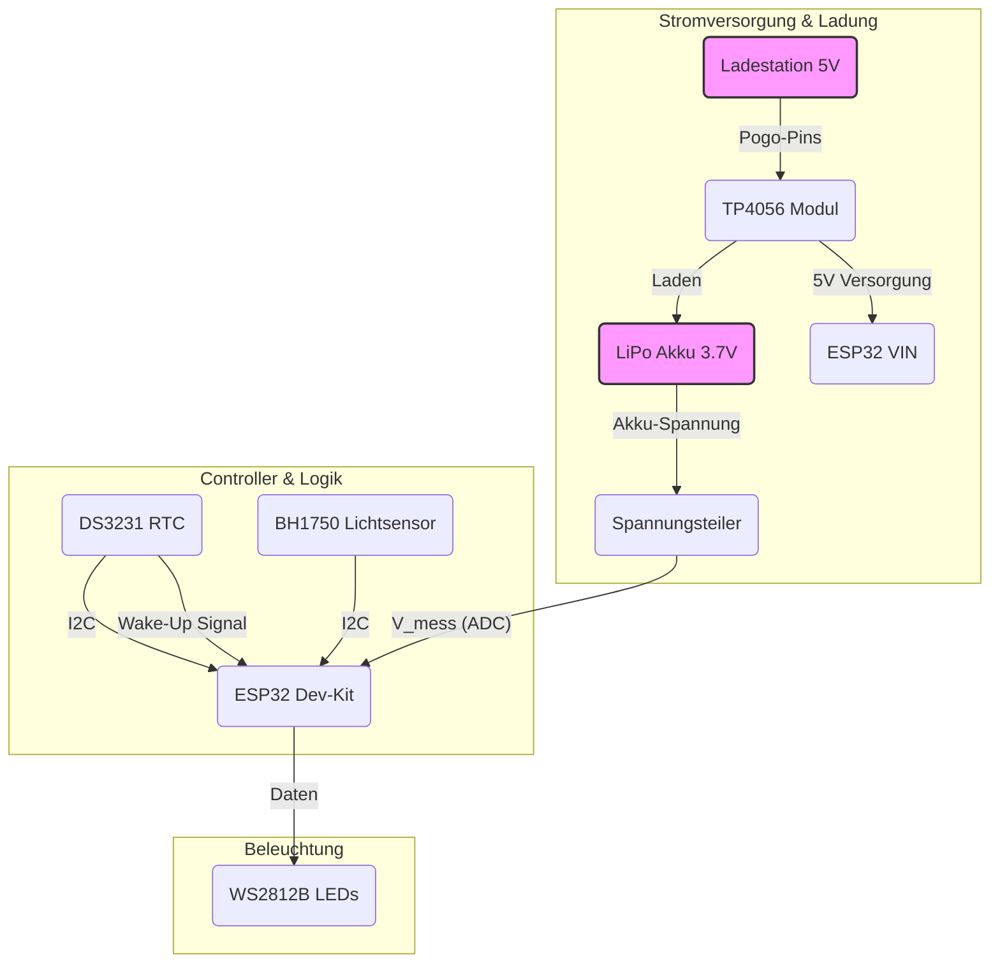

# Hardware & Schaltung

Dieses Dokument beschreibt die für den Prototypen der smarten Tischlampe ausgewählte Hardware und deren Verschaltung. Das Design ist auf hohe Energieeffizienz und Modularität ausgelegt.

## Schaltungsübersicht

Die folgende Darstellung ist ein funktionales Blockdiagramm, das die logischen Verbindungen zwischen den Hauptkomponenten zeigt. Es dient dem schnellen Verständnis des Systems. Eine detaillierte, technische Schaltung wird nach Abschluss des PCB-Designs in KiCad als Bild exportiert und hier verlinkt.



## Komponenten im Detail

| Komponente | Spezifikation / Beispiel | Zweck & Begründung |
| --- | --- | --- |
| **Mikrocontroller** | ESP32 Dev-Kit (z.B. Lolin D32) | Das Herz der Lampe. Gewählt wegen des integrierten WLANs, der hohen Effizienz (Deep Sleep) und der starken Community-Unterstützung (WLED). **Wichtig:** Das Board muss einen **Schaltregler (Buck/Step-Down)** statt eines LDOs haben, um den Akku effizient von 3.7V auf 3.3V zu wandeln. |
| **LEDs** | WS2812B "NeoPixel" Ring | Adressierbare RGB-LEDs, die komplexe Effekte ermöglichen und von WLED nativ unterstützt werden. Ein Ring-Layout sorgt für eine gleichmäßige Ausleuchtung. |
| **Echtzeituhr (RTC)** | DS3231 Modul | Ein hochpräziser Zeitgeber, der auch ohne Stromversorgung die Uhrzeit hält. Essentiell, um den ESP32 zur richtigen Zeit aus dem Deep Sleep aufzuwecken, was massiv Strom spart. |
| **Lichtsensor** | BH1750 Modul | Misst die Umgebungshelligkeit. Ermöglicht der Lampe, ihre eigene Helligkeit automatisch anzupassen – heller in heller Umgebung, dunkler (und sparsamer) in dunkler Umgebung. |
| **Akku** | LiPo-Akku, 3.7V, &gt;2500mAh | Lithium-Polymer-Akkus bieten eine hohe Energiedichte. Die Kapazität wird für eine Laufzeit von mindestens 12 Stunden ausgelegt. |
| **Lademodul** | TP4056-basiertes Modul | Ein bewährter und günstiger Ladecontroller für LiPo-Akkus. Er schützt den Akku vor Überladung und Tiefentladung. |
| **Ladekontakte** | Pogo-Pins & Kupferflächen | Ermöglichen eine robuste, verschleißfreie Ladeverbindung ohne fummelige Stecker. Ideal für den häufigen Gebrauch in der Gastronomie. |
| **Spannungsteiler** | 2x 100kΩ Widerstände | Eine einfache Schaltung, um die Akkuspannung (bis zu 4.2V) auf einen für den ESP32-ADC (max. 3.3V) sicheren Wert zu reduzieren. |

## Pin-Belegung & Verkabelung

Die Komponenten werden wie folgt mit einem typischen ESP32-Board verbunden.

| ESP32 Pin | Verbinden mit... | Anmerkung |
| --- | --- | --- |
| **3V3** | VCC von DS3231 & BH1750 | Stromversorgung für die I2C-Sensoren. |
| **GND** | GND von allen Komponenten | Gemeinsamer Massepunkt ist essenziell. |
| **GPIO 22 (SCL)** | SCL von DS3231 & BH1750 | Die Clock-Leitung für den I2C-Bus. |
| **GPIO 21 (SDA)** | SDA von DS3231 & BH1750 | Die Daten-Leitung für den I2C-Bus. |
| **GPIO 16** | Daten-Pin (DIN) der WS2812B LEDs | Ansteuerung der LEDs. |
| **GPIO 34 (ADC)** | Mitte des Spannungsteilers | Eingang zur Messung der Akkuspannung (nur ein ADC-Pin der ersten Generation). |
| **GPIO 35** | SQW-Pin des DS3231 | Empfängt das Weck-Signal (Interrupt) von der RTC. |

### Stromversorgung (Power Path)

1.  Die **Ladestation** liefert 5V über die **Pogo-Pins**.
2.  Die Pogo-Pins sind mit den `IN+` und `IN-` Anschlüssen des **TP4056-Moduls** verbunden.
3.  Der **LiPo-Akku** ist an `B+` und `B-` des TP4056 angeschlossen und wird von diesem geladen.
4.  Der `OUT+` und `OUT-` Ausgang des TP4056 versorgt den **VIN-Pin (5V)** des ESP32-Boards. Der On-Board-Spannungsregler des ESP32-Boards erzeugt daraus die benötigten 3.3V.

### Schaltung für die Akkuspannungsmessung

```
(Akku +) --- [100kΩ Widerstand] ---+--- [100kΩ Widerstand] --- (GND)
                                  |
                                  +--- (ESP32 GPIO 34)
```
Diese Schaltung halbiert die Akkuspannung und schützt so den ADC-Pin des ESP32.